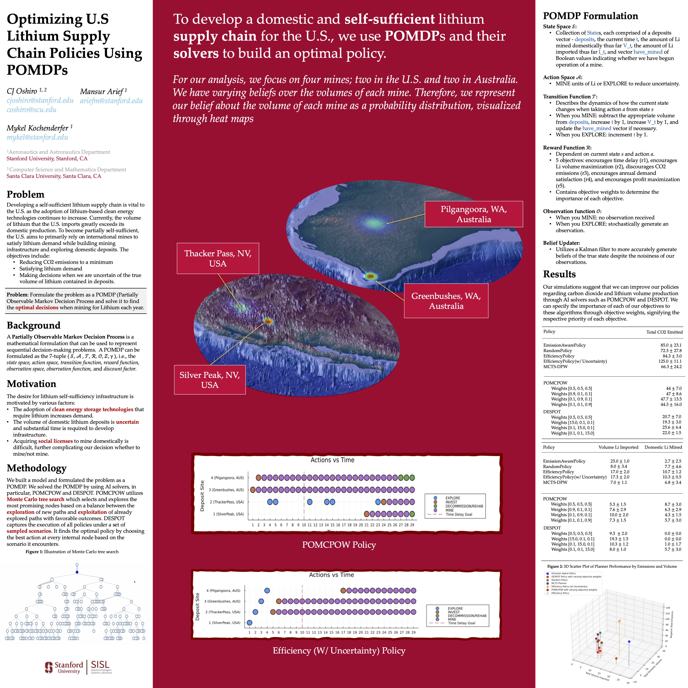

# Optimizing U.S Lithium Supply Chain Policies Using POMDPs

## Project Overview
In the summer of 2024, I was a research fellow in Stanford's Summer Undergraduate Research Fellowship (SURF) where I worked in the Stanford Intelligent Systems Laboratory (SISL). This research project focused on strategically modeling the U.S. lihium supply chain to determine an optimal policy regarding securing a viable lithium supply for U.S. interests through domestic infrasctructure and foreign imports. 

## Contributions
We formulated this problem as a Partially Observable Markov Decision Process (POMDP) to determine the optimal policy regarding lithium mining to accomplish sustainability and supply objectives. We used Julia to develop and design the POMDP model and I contributed to the development of the LiSCPOMDP (Lithium Supply Chain POMDP) Julia package. The package is published [here](https://github.com/mansurarief/LiSCPOMDP) on SISL's github. 

## Code Samples
I spent a lot of my time coding in this research opportunity. All my coding contributions to this project are located in the LiSCPOMDP package on the SISL Github repository [here](https://github.com/mansurarief/LiSCPOMDP/tree/main/src). I worked on various files in the src directory but my most notable coding contributions are in: 
 * [model.jl](https://github.com/mansurarief/LiSCPOMDP/blob/main/src/model.jl)
 * [policies.jl](https://github.com/mansurarief/LiSCPOMDP/blob/main/src/policies.jl)
 * [pomdp.jl](https://github.com/mansurarief/LiSCPOMDP/blob/main/src/pomdp.jl)

#### What This Code Demonstrates
* Formulating real-world policy problems as Partially Observable Markov Decision Processes
* Defining state, action, transition, observation, and reward models
* Implementing a full POMDP in Julia / POMDPs.jl
* Structuring reusable model components and simulation logic
* Working with belief updates and uncertainty modeling
* Running experiments using solvers such as Partially Observable Monte Carlo Planning with Observation Widening (POMCPOW), Determinized Sparse Partially Observable Tree (DESPOT), or Monte  Carlo Tree Search (MCTS)

## Research
My work culminated into a research poster presented at the Stanford Summer Undergraduate Research Fellowship Symposium. Check out the PNG here or view or download the [pdf](https://github.com/Cjoshiro/LithiumPOMDP/blob/main/StanfordResearchPoster.pdf)! Our work also resulted in a paper linked [here](https://arxiv.org/abs/2502.05690).

